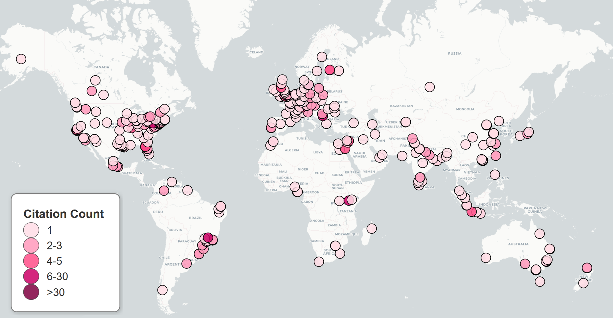

# MapCitator
MapCitaTor: Visualize Your Scholarly Impact Worldwide

## Description
MapCitator is a Python tool that visualizes the global reach of your research by mapping the locations of scholars who have cited your work. By importing your Google Scholar profile, MapCitator generates an interactive world map highlighting where your citations originate, helping you explore your academic impact geographically.

## Features

- **Automated Citation Extraction:** Fetches citation data from your Google Scholar profile.
- **Geographic Visualization:** Plots citation locations on an interactive world map.
- **Citation Density Coloring:** Uses color-coded markers to represent citation counts at each location.
- **Customizable Legend:** Displays a draggable legend for easy interpretation of citation densities.
- **Exportable Results:** Saves both the citation data (`citations.csv`) and the interactive map (`custom_label_map.html`).

## Prerequisites

- Python 3.7 or newer
- Required Python packages:
  - `folium`
  - `citation_map` (or any other module for extracting citation data)

## Installation

1. **Clone the Repository:**
    ```
    git clone git@github.com:Dias-Lab/MapCitator.git
    cd mapcitator
    ```

2. **Install Dependencies:**
    ```
    pip install -r requirements.txt
    ```

# Usage

1. **Get Your Google Scholar ID:**
   - Go to your [Google Scholar profile](https://scholar.google.com).
   - Your Scholar ID is the string after `user=` in the URL.  
     Example:  
     ```
     https://scholar.google.com/citations?user=AbC123DEFgHI
     ```

2. **Run MapCitator:**
    ```
    python mapcitator.py <YOUR_SCHOLAR_ID>
    ```
    Example:
    ```
    python mapcitator.py AbC123DEFgHI
    ```

3. **View Results:**
   - `citations.csv`: CSV file with citation locations and counts.
   - `custom_label_map.html`: Interactive map to open in your browser.


## Outputs

After running MapCitator, you will get a `citations.csv` and a `custom_label_map.html`. 

### Citation Data Table Example


### Citation Map Example



You can also view a live example of the interactive map by opening [`examples/Dias_custom_label_map.html`](examples/Dias_custom_label_map.html) in your browser.


## Troubleshooting

- **citation_map module not found:**  
  Ensure the `citation_map` module is installed or available in your project directory.
- **No citations found:**  
  Double-check your Scholar ID and that your profile is public.


## License

MIT License


## Contributing

Pull requests are welcome! For major changes, please open an issue first to discuss what you would like to change.


**Map your impact. Discover your reach. – MapCitator**

## Citation

If you use MapCitator in your research or projects, please consider citing this repository to give proper credit:

@misc{mapcitator2025,
author = {Raquel Dias},
title = {MapCitator: A Tool for Mapping Scholarly Citations},
year = {2025},
howpublished = {\url{https://github.com/yourusername/mapcitator}},
note = {Accessed: YYYY-MM-DD}
}
